# Project Pluto: Arduino GPS w/ microSD logging and Bluetooth
This is Project Pluto: an Arduino-based battery-powered GPS data-logger with customizable settings and Bluetooth pairing to mobile phone or compatible DSLR.

The finished product is self-contained on a printed PCB in a 3D-printed enclosure, with majority of components plugged into headers to aid in possible future upgrades and enable repurposing of components.

  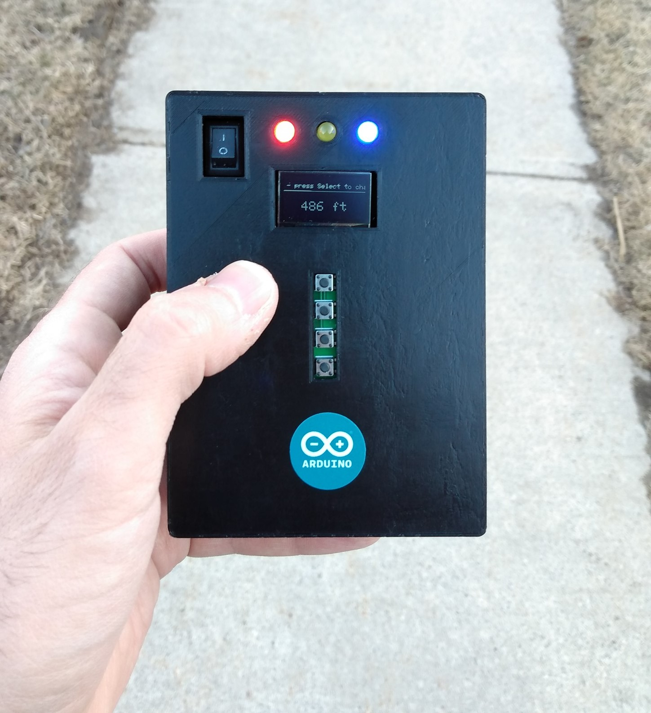

## Why?
I'm an active travel photographer, and use various hardware & software-based solutions to geo-tag my images on the fly. With no prior knowledge of Arduino development, CAD, electronics or circuit design, I wanted to see if I was able to build a portable geo-tagging solution to meet my own needs. And I did it. Kind of (see [Disclaimer](#Disclaimer)).

On a whim and for no particular reason, I've named it Project Pluto.

## Features
- Display of various parameters in real-time (co-ordinates, date & time, speed, altitude, heading and satellite count), with the ability to change measurement units where applicable (ie. feet or meters)
- Logging of co-ordinates to microSD card
- Bluetooth pairing with mobile phone or NMEA 0183-compatible DSLR (see [Specifications and Requirements](#Specifications-and-Requirements))
- LEDs to indicate satellite and Bluetooth fix, and microSD card activity
- Individual features (logging, Bluetooth, LEDs) may be toggled on or off, with settings retained across power-cycles
- Long-pressing of individual buttons to quickly toggle key settings (logging, Bluetooth or LED state)

## Repository Contents
- [C++ source code](./Arduino-sketch.ino) for uploading to an Arduino or compatible clone
- [EasyEDA project](./PCB) for modifying the PCB schematic
- [Fritzing circuit diagram](./Fritzing-circuit-diagram.fzz)
- [Gerber file](./PCB) for printing a PCB
- [STL files](./STL) for 3D-printing an enclosure

## Parts List
| Quantity | Description | Note |
| --- | --- | --- |
| 1 | Arduino Nano Every w/ soldered straight male headers | A genuine Arduino Nano Every is required as clones do not use the required ATMega4809 processor 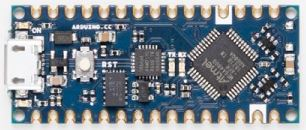 |
| 1 | u-blox NEO-6M GPS module w/ external antenna and built-in EEPROM, and soldered straight male header | Part GY-NEO6MV2: 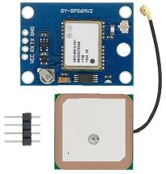 |
| 1 | HC-05 Bluetooth module on ZS-040 baseboard w/ soldered right-angle male header | Enable and State pins need to be connected for programming 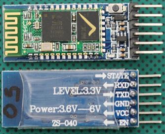 |
| 1 | SSD1306 0.96" 128x64 I2C OLED display w/ soldered straight male header | Of the following form-factor: 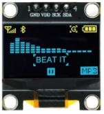 |
| 1 | SPI microSD card adaptor w/ soldered right-angle male header | Of the following form-factor: 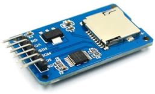 |
| 1 | 4-key button-board module w/ soldered straight male header | 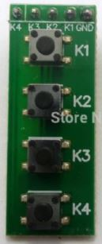|
| 1 | 4-channel 3.3V/5V bi-directional logic-level-converter (LLC) w/ soldered straight male headers | Of the following form-factor: 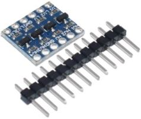 |
| 1 | Pololu 5V step-up voltage regulator w/ soldered straight male header | Part NCP1402: 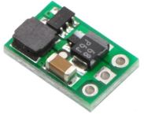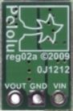 |
| 1 | 2N2222 NPN transistor | For turning on and off the HC-05 Bluetooth module 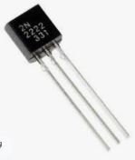 |
| 1 | 2-pin SPST rocker switch | 15mm\*10mm, in the following form-factor: 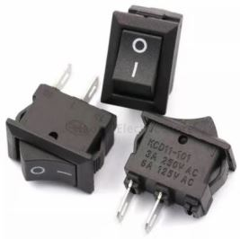 |
| 3 | 5mm LED | Can be a standard 'dome' shape, resulting in slight protusion when in enclosure; or flat-top, which will be flush with enclosure. Each should ideally be of a different color to represent their distinct use; I use red for satellite fix, yellow for logging, and blue for Bluetooth fix 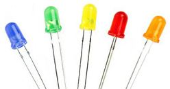 |
| 3 | 220Ω resistor | 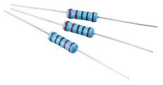 |
| 1 | SMT AA battery holder | Approximately 59mm\*29mm (from Blossom Electronics, or Keystone part 1022): 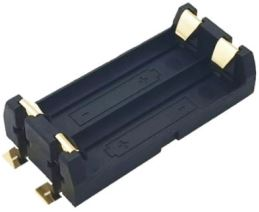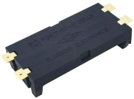 |
| 1 | 3-pin 2.54mm-pitch straight female header | Source rows of these in bulk, from which the required size can be cut: 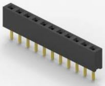 | 
| 2 | 15-pin 2.54mm-pitch straight female header | Source rows of these in bulk, from which the required size can be cut:  |
| 2 | 4-pin 2.54mm-pitch straight female header | Source rows of these in bulk, from which the required size can be cut:  |
| 2 | 6-pin 2.54mm-pitch right-angle female header | Source rows of these in bulk, from which the required size can be cut: 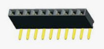 |
| 2 | 6-pin 2.54mm-pitch straight female header | Source rows of these in bulk, from which the required size can be cut:  |
| 3 | 2-pin 2.54mm-pitch straight female header | Source rows of these in bulk, from which the required size can be cut:  |
| 4 | 6mm M2 screw | Used in retaining u-blox NEO-6M GPS module and SSD1306 0.96" 128x64 I2C OLED display on printed PCB. Source a single 'M2 Male-Female Spacer Standoff Screw Nut' kit that contains all required screw/spacer/standoff parts from this list: 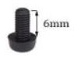 |
| 2 | 8mm M2 screw | Used in retaining 4-key button-board module on printed PCB. Source a single 'M2 Male-Female Spacer Standoff Screw Nut' kit that contains all required screw/spacer/standoff parts from this list: 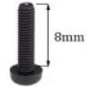 |
| 8 | M2 spacer | Used in retaining u-blox NEO-6M GPS module, SSD1306 0.96" 128x64 I2C OLED display, 4-key button-board module and SPI microSD card adaptor on printed PCB. Source a single 'M2 Male-Female Spacer Standoff Screw Nut' kit that contains all required screw/spacer/standoff parts from this list: 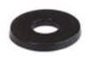 |
| 2 | 6mm M2 double-passthrough standoff | Used in retaining SPI microSD card adaptor on printed PCB. Source a single 'M2 Male-Female Spacer Standoff Screw Nut' kit that contains all required screw/spacer/standoff parts from this list: 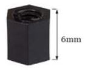 |
| 6 | 10mm M2 double-passthrough standoff | Used in retaining u-blox NEO-6M GPS module and SSD1306 0.96" 128x64 I2C OLED display on printed PCB. Source a single 'M2 Male-Female Spacer Standoff Screw Nut' kit that contains all required screw/spacer/standoff parts from this list: 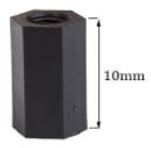 |
| 11 | 12mm M2 screw | Used in retaining HC-05 Bluetooth module and SPI microSD card adaptor on printed PCB, and to fasten enclosure. Source a single 'M2 Male-Female Spacer Standoff Screw Nut' kit that contains all required screw/spacer/standoff parts from this list: 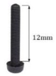 |
| 1 | M2 nut | Used in retaining HC-05 Bluetooth module on printed PCB. Source a single 'M2 Male-Female Spacer Standoff Screw Nut' kit that contains all required screw/spacer/standoff parts from this list: 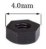 |
| 8 | M2 washer | Used in fastening enclosure, to avoid fracturing. Source a single 'M2 Male-Female Spacer Standoff Screw Nut' kit that contains all required screw/spacer/standoff parts from this list:  |
| 8 | 3.5mm\*5mm M2 heat-set insert | Used in fastening enclosure. Inside diameter of M2 (2mm), outside diameter of 3.5mm, inside length of 5mm: 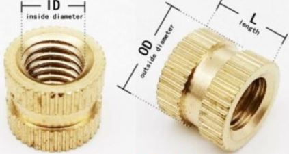 |
| 2 | AA battery | 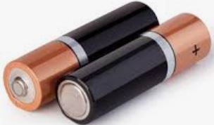 |

## Libraries and Compile Requirements
Project Pluto uses the following libraries:
- [Adafruit SSD1306](https://github.com/adafruit/Adafruit_SSD1306)
- [EEPROM](https://www.arduino.cc/en/Reference/EEPROM)
- [NeoGPS](https://github.com/SlashDevin/NeoGPS)
- [SdFat](https://github.com/greiman/SdFat)
- [SoftwareSerial](https://www.arduino.cc/en/Reference/softwareSerial)
- [SPI](https://www.arduino.cc/en/reference/SPI)

I had to do the following to compile against the Arduino Nano Every, though these changes may no longer be required:
- NeoGPS: remove the `class Print` forward declarations from the following files:
    - DMS.h
    - NeoTime.h
- SdFat: set `SPI_DRIVER_SELECT` to `1` in **SdFatConfig.h** per [greiman/SdFat-beta#42](https://github.com/greiman/SdFat-beta/issues/42)
- Change `#define F(str) (str)` in **Arduino.h** to `#define F(str) (const __FlashStringHelper*)(str)`

## Build Instructions

  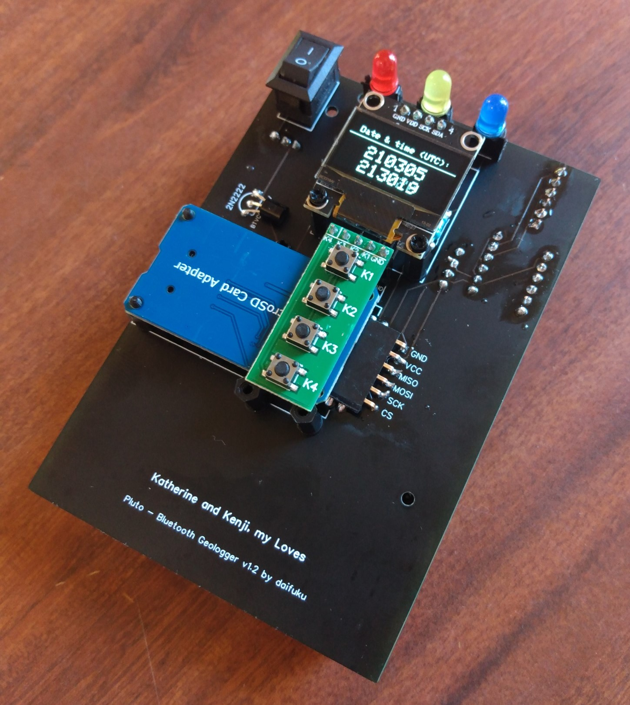
  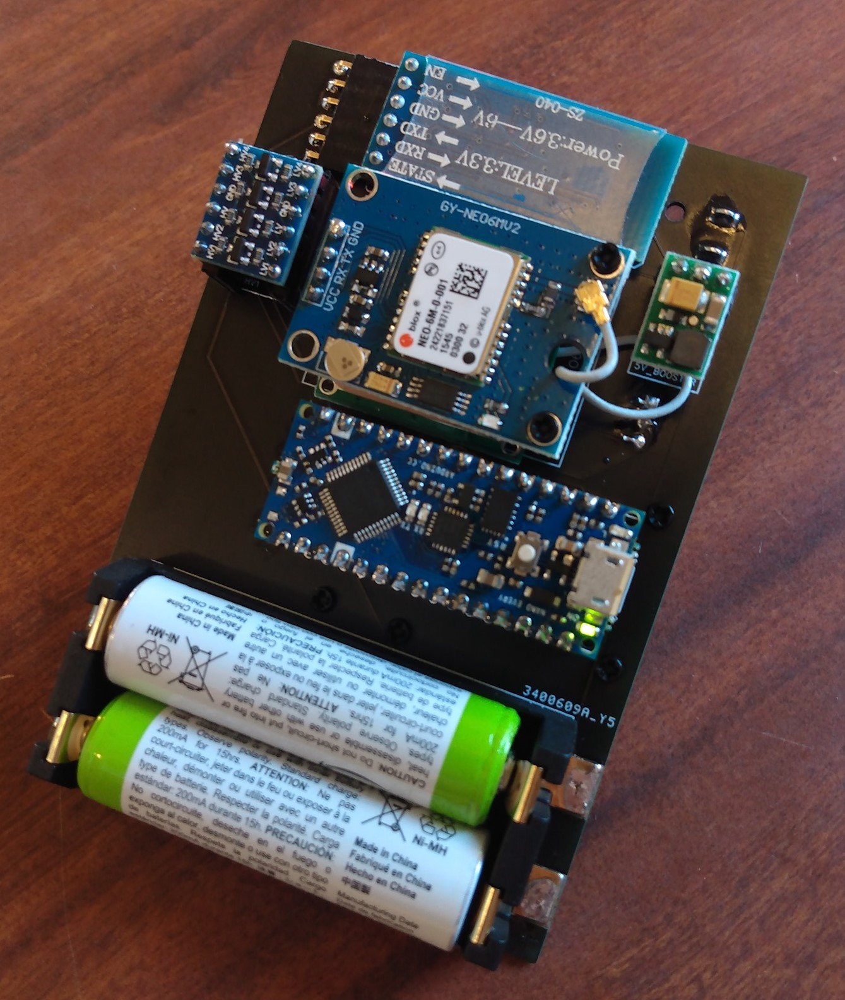

Due to the overlapping of the Arduino Nano Every and SPI microSD card adaptor on opposing sides of the PCB, I suggest building in the following sequence:
1. Print this repository's STL files; I forget settings used, but note the following:
    - Wall thickness should be adjusted to accommodate heat-set inserts
    - Supports are required only for [Project-Pluto-enclosure-top.stl](./STL/Project-Pluto-enclosure-top.stl)
    - I've applied gluestick to the printer's bed
2. Insert heat-set inserts to holes on printed [Project-Pluto-enclosure-top.stl](./STL/Project-Pluto-enclosure-top.stl)
3. [Print a PCB](https://jlcpcb.com/) from this repository's Gerber file, with the following settings:
    - 2 layers
    - 1.6mm PCB thickness
4. Solder **220Ω resistors**, **2N2222 NPN transistor** and **2-pin SPST rocker switch** in their respective footprints on the PCB
5. Solder all **straight female headers** from the [Parts List](#Parts-List) to each component's respective footprint on the PCB, except for the microSD card adaptor and HC-05 Bluetooth module
6. Solder **right-angle female headers** to the footprints of the **HC-05 Bluetooth module** and **microSD card adaptor**, slightly tilting back the latter to clear the Arduino Nano Every female header's solder joints
7. Solder **SMT AA battery holder**, ensuring correct orientation of terminals according to footprint on PCB
8. Trim legs of each LED so base rests flush with female headers
9. Plug-in and screw-down (where required) remaining components:
    - HC-05 Bluetooth module
    - u-blox NEO-6M GPS module
    - LLC
    - Pololu 5V step-up voltage regulator
    - Arduino Nano Every
    - LEDs
    - SSD1306 0.96" 128x64 I2C OLED display
    - SPI microSD card adaptor
    - 4-key button-board module
10. Recess the completed unit into the front half of the enclosure, being careful to ensure the LEDs slip properly into their respective cavities
11. Insert AA batteries
12. Screw-down enclosure with 12mm M2 screws (and washers, to avoid fracturing the enclosure)

## Operating Instructions
### Specifications and Requirements
- u-blox NEO-6M GPS and HC-05 Bluetooth modules operate at 4800 baud, for Nikon DLSR-compatibility
- Pairs with any Bluetooth Serial Port Profile (SPP) NMEA 0183-compatible device with PIN/passkey 0000
- microSD card required for logging and waypoint-marking
- When enabled, logging of co-ordinates to microSD card at 2-second intervals
- Battery life is poor; expect 2 to 4 hours

### Startup Sequence
1. Any user-changed settings are restored from EEPROM
2. If **Waypoint-Marker** button is held, reset baud rate of HC-05 Bluetooth module to 4800 (required for Nikon DSLR pairing using Bluetooth dongle)
3. Initialize access to microSD card if one's inserted; else disable logging
4. Set baud rate of u-blox NEO-6M GPS module to 4800 (required for Nikon DSLR pairing using Bluetooth dongle)
5. Set compatibility mode on u-blox NEO-6M GPS module and co-ordinate-system to 4-decimal places (required for Nikon DSLR pairing using Bluetooth dongle)
6. Up-and-running

### Display and Navigation
- The **main** interface is comprised of individual screens that display different information:
    - Date & Time (UTC)
    - Speed
    - Heading
    - Altitude
    - Satellite count
- The **Settings** screen displays the following user-configurable options:
    - Logging: ON or OFF; remains OFF if microSD card not inserted at boot 
    - Bluetooth: ON or OFF
    - (Screen) Timeout: 5-30 seconds
    - LEDs: ON or OFF
    - Reset to defaults: Logging and Bluetooth OFF; Timeout of 5 seconds; LEDs ON
    - Done: Write settings to EEPROM for recalling across power-cycles
- See the [Button Functions](#Button-Functions) table regarding how to navigate the interface

### Button Functions
| Button | Short-Press | Long-Press (3-seconds) |
| --- | --- | --- |
| **Select** (**K1** on button-board; **D5** on PCB) | - Change measurement units where applicable - Toggle or increment settings - Highlight on-screen elements requiring confirmation | Toggle logging state on and off and write to EEPROM for recalling across power-cycles |
| **Next** (**K2** on button-board; **D6** on PCB) | - Cycle through screens - Confirm highlighted selection | Toggle Bluetooth state on and off and write to EEPROM for recalling across power-cycles |
| **Waypoint-Marker** (**K3** on button-board; **D7** on PCB) | N/A | **During normal use:** - Record current co-ordinates in file on microSD card, regardless of logging state - Requires a satellite-fix and microSD card inserted at boot  **During startup:** - Reset baud rate of HC-05 Bluetooth module to 4800 (required for Nikon DSLR pairing using Bluetooth dongle) |
| **LED State** (**K4** on button-board; **D8** on PCB) | N/A | Toggle state of all LEDs on and off and write to EEPROM for recalling across power-cycles |

### LED Behaviour
- **GPS** (left-most LED)
    - Blink: No satellite-fix
    - On: Satellite-fix
- **Logging** (middle LED)
    - Blink: microSD card activity
    - On: microSD card not inserted at boot or error writing to card
- **Bluetooth** (right-most LED)
    - Blink: Searching
    - On: Paired
    - Off: Bluetooth is disabled
- Long-pressing a button to toggle settings on and off results in the respective LED being lit for 2-seconds to visually indicate state change

### microSD Card Behaviour
- When logging is on:
  1. File **yymmdd_log_nn.txt** is created in the root of the microSD card with a header row each time logging state is changed to **ON** and a date & time is acquired from the GPS (where **yymmdd** equals current UTC date, and **nn** equals incrementing number beginning with 00)
  2. Given a satellite-fix, the following comma-delimited fields are appended to the file at 2-second intervals
     - Latitude
     - Longitude
     - Speed (km/h)
     - Heading (degrees)
     - Altitude (floating-point meters)
     - Date and Time (UTC)
- Waypoint-markers are appended to file **waypoints.txt** in the same format as above, regardless of logging state

## Disclaimer
**Build and use at your own risk.** I am not an electrical engineer, nor a working C++ developer; this is a passion-project constructed in between diaper changes and one-too-many beers, and is likely replent with bugs. That said, it functions as intended, and has yet to blow up.
